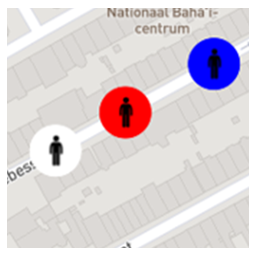
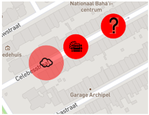
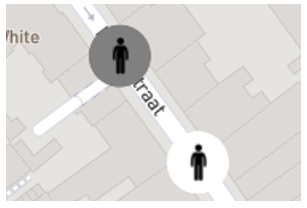
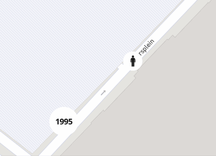
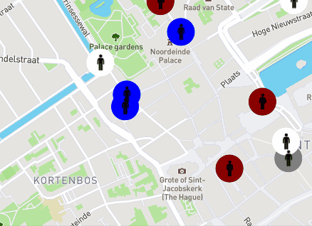

NOTE: The presentation, as well as the text in the PowerPoint, is written in Dutch.

# Introductie 

Van februari 2021 t/m juli 2021 zijn wij (Melissa Basgöl en Simone Hartgring) als stagiaire voor TNO bezig geweest met het uitbreiden van een simulatie omgeving.

Aan het begin van onze stage hebben wij een 2D agent-based simultieomgeving aangleverd gekregen. Hierin worden gedragingen gesimuleerd door agents, die bijvoorbeeld mensen representeren, eigenschappen en taken te geven. Zo kan een agent de taak krijgen om bijvoorbeeld naar werk te gaan. In de visualisatie zie je dan een agent over een kaart bewegen naar zijn locatie. Er wordt ook gebruik gemaakt van een route services die ervoor zorgt dat de agent een daadwerkelijke route volgt en niet door gebouwen heen loopt. Een agent kan ook iets anders dan een mens representeren, zoals bijvoorbeeld een drone.

Wij hebben de opdracht gekregen om deze simulatieomgeving uit te breiden. Het doel is om de omgeving uiteindelijk te kunnen gebruiken om hier verschillende dreigingsscenario’s in te simuleren en de effectiviteit van verschillende acties van de defensie in deze scenario’s te evalueren.

Er zijn drie verschillende teams in de scenario’s betrokken. Team wit, team rood, en team blauw. Op de afbeelding is te zien hoe de verschillende teams gevisualiseerd worden. Team wit bestaat uit de gewone burgers. Team rood bevat de agents die de dreiging vormen en team blauw is de defensie. 

In een aantal scenario’s zijn specifieke te beschermen personen aanwezig, deze zijn met een paarse kleur aangegeven.
We hebben het gewone gedrag van de witte agents uitgebreid , dus bijvoorbeeld door winkelen en rondhangen in een park toe te voegen. We hebben de gedragingen van rood en blauw toegevoegd en we hebben reacties van de verschillende agents op bepaalde gebeurtenissen toegevoegd.

# Interactie

Voor interactie tussen DE agents zijn er bepaalde basis functionaliteiten nodig, zoals het bijhouden van de locatie van de agents en de communicatie tussen de agents. 
Het is van belang dat de locatie van de agents ergens wordt bijgehouden zodat de agents binnen een bepaald gebied opgevraagd kunnen worden. 
*Voorbeeld: Als er een bom ontploft, dan moeten alleen de omstanders gewond raken.*

Ook moeten de agents een op een kunnen communiceren.   
*Voorbeeld1: Als twee agents op straat in de buurt van elkaar zijn moeten ze elkaar kunnen aanspreken.*   
*Voorbeeld2: Als de politie gebeld wordt, moet de politie naar de locatie gestuurd worden.*

Aan veel acties moet dus ook een reactie gekoppeld zijn. 
En naast deze basis functionaliteiten moeten de agents ook effect op elkaar hebben. Ze moeten ook elkaar schade kunnen geven.

De communicatie werkt met een berichten systeem, waarbij agents berichten binnenkrijgen. 
Zo krijgen agents een alert over een bepaalde actie van iemand anders en kan hierop gereageerd worden. 
Hiervoor zijn er reacties gecreëerd die gekoppeld zijn aan bepaalde gedragingen.   
*Voorbeeld: Bijvoorbeeld als iemand in de buurt een vuurwapen gebruikt, kunnen de agents binnen een bepaalde radius hier bewust van worden en er op reageren door bijvoorbeeld weg te rennen.*

De reacties zijn natuurlijk ook gekoppeld aan het team van de agent. Blauwe agents moeten achter de persoon aangaan terwijl de witte gaan wegrennen.

De reacties zijn ook gebaseerd op prioriteiten. Niet iedereen zal reageren op een bepaalde situatie. Als iemand op weg is naar zijn werk en het is een belangrijke dag dus zijn actie heeft een erg hoge prioriteit dan zal die niet stoppen op straat als iemand hem aanspreekt. 

Dus tijdens het reactie proces wordt er gekeken naar de prioriteit van de actie en de urgentie van het bericht die binnenkomt.

Agents kunnen elkaar met behulp van de damage service schade geven. Waarbij er op basis van de gebruikte wapen schade wordt gegeven aan het doelwit. 
Ook zijn er beschermende middelen zoals een gasmasker en kogelwerende vesten. 

# Technische achtergrond

De simulatie is geschreven in Typescript en werkt met een game loop. In de game loop worden alle agents en de locaties van de agents geupdate. De locaties van de agents worden als geolocaties opgelagen in een redis database.  De data wordt aan het einde van de game loop doorgestuurd naar kafka zodat de visualisatie ook geupdate kan worden. Ook worden er aan het einde van de game loop “berichten” gestuurd van de huidige actie van de agents en de “mailbox” van de agents worden gelezen. Verder wordt aan het einde van de loop de simulatietijd geupdated. De tijdsstap waarmee dit gebeurt is afhankelijk van de simulatiesnelheid.

Verder wordt er gebruikt gemaakt van OSRM. Dit is eigenlijk een routing engine die de kortste paden bepaald in het netwerken van wegen. Hiermee worden de loop, fiets en rij routes van de agents bepaald.

# Gedragingen

## Rood

Het rode gedrag is, zoals eerder is genoemd, het gedrag dat de dreiging vormt of veroorzaakt.
Een aantal van deze acties zijn aan de simulatieomgeving toegevoegd. 

Ten eerste is toegevoegd dat een agent een object bij zich kan dragen en deze vervolgens ergens achter kan laten. Dit kan een bom zijn die na een tijdje ontploft, gas dat na een tijdje verdwijnt, of een onbekend object.  

 

Als een bom ontploft is er een zone waarin alle agents om het leven komen en een zone waarin agents gewond raken. Agents die niet meer leven worden aangegeven met een donkerdere kleur. 

 

Ook kunnen de rode agents direct aanvallen. Daarbij kunnen ze bijvoorbeeld een handgranaat ergens heen gooien, daarbij wordt een random locatie in de buurt gekozen waar hij beland (zelfde als een bom) of ze kunnen met een handvuurwapen iemand neerschieten (random agent in de buurt).

## Wit

Zoals eerder genoemd is het gewone gedrag van team WIT uitgebreid, maar we zullen het nu vooral hebben over het gedrag van team wit in een dreigingsscenario.

Tot nu toe krijgen de witte agents bij elke dreiging de reactie om weg te rennen. Hierbij wordt een locatie gekozen op een bepaalde afstand in tegengestelde richting van het gevaar (dus ze rennen van het gevaar weg) waar ze naartoe rennen. 

Er zijn twee soorten agents van team wit die in een situatie reageren: losse agents en groepen. Als een groep weg rent wordt af en toe een gewond persoon achtergelaten. Dit is iemand die bijvoorbeeld is gevallen en waar anderen vervolgens over heen zijn gerend. Als deze persoon hier niet te gewond voor is vlucht hij verder als losse agent.  
Bij losse agents wordt gekeken naar of er andere agents in zijn buurt staan. Als er een groep erg dichtbij staat zal de agent zich bij de groep aansluiten en als er een andere losse agent in de buurt staat is er een kans dat ze botsen. Dan staat de agent even stil en raakt hij potentieel gewond.

 

## Blauw

Blauwe agents hebben in de simulatie twee hoofdtaken: patrouilleren en bewaken
Er zijn ook DSI (dienst speciale interventie) agents die alleen in bepaalde situaties voorkomen.

Als er rode agents zijn moeten de blauwe agents op de acties van de rode agents kunnen reageren.
De volgende gedragingen die toegevoegd zijn om dit te realiseren:
* Iemand achtervolgen
* Iemand aanvallen
* Bedreigingen opsporen en aanvallen (dsi)
* Iemand ondervragen

Op het moment dat de politie wordt gebeld of een alert binnenkrijgt, moet er bepaald worden welke politie agents naar de locatie gestuurd zullen worden. Hiervoor is er een dispatch service die wordt aangeroepen als de politie gebeld wordt, of als er een alert gestuurd wordt. Op basis van het type event worden er agenten gestuurd naar de locatie.

 